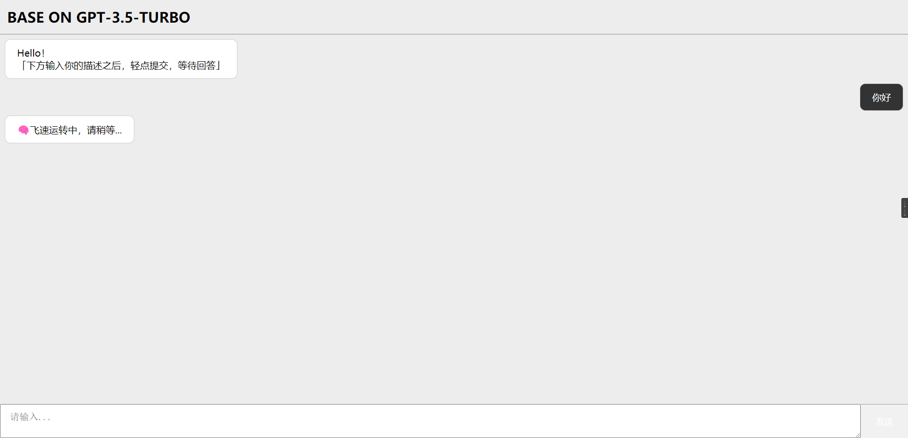
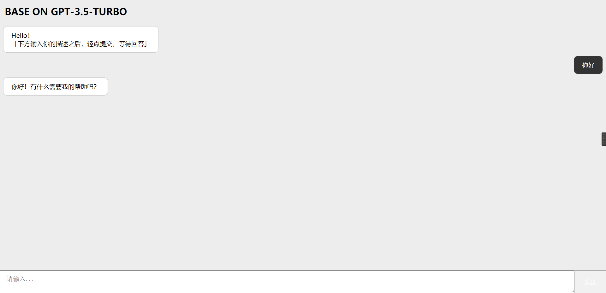

# ChatGPT Web聊天机器人-后台

**⚡** **已接入最新gpt-3.5-turbo模型**

```
码云仓库地址：https://gitee.com/JN910-14/ChatGPT-Web-ChatAI-Backend
web端地址：https://github.com/Rlvse/ChatGPT-Web-ChatAI
```

## 🔧 环境要求

1.科学上网

2.注册获取key

## ⚙功能

* 聊天

## **⚡** 上图

**图片地址有问题的话，看码云仓库的吧，同步更新的**、





## 👻交流or反馈

有交流or反馈，可以扫PDF二维码联系

服务器搭建/项目部署问题，可以扫PDF二维码联系


## ⚡小程序万能生成器版本

在线体验


```https://github.com/Rlvse/ChatGPT-miniapp
码云版本：https://gitee.com/JN910-14/ChatGPT-miniapp
github版本：https://github.com/Rlvse/ChatGPT-miniapp
```